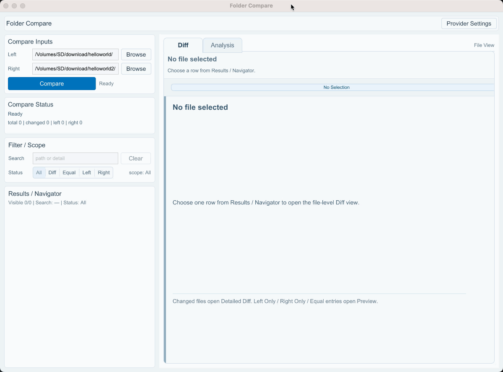

# Folder Compare (Rust Workspace)

一个面向本地目录对比的 Rust workspace 项目，包含确定性的目录/文本 diff 引擎、可选 AI 分析层，以及基于 Slint 的桌面 UI。

当前项目状态（2026-03-19）：

- workspace `version = "0.2.18"`
- workspace `edition = "2024"`
- `rust-toolchain = 1.94.0`
- workspace `rust-version = 1.94`
- `slint = 1.15.1`
- `slint-build = 1.15.1`
- `phase15 summary` 已完成
- `Phase 16A` 已完成
- `Phase 15.3A`、`Phase 15.3B`、`Phase 15.4`、`Phase 15.5`、`Phase 15.5 fix-1`、`Phase 15.5 fix-2`、`Phase 15.5 fix-3`、`Phase 15.6`、`Phase 15.7`、`Phase 15.8`、`Phase 15.8 fix-1`，以及独立 workspace `edition = "2024"` 里程碑均已完成
- `15.2E` 已在当前基线上发货
- 当前主线下一步是继续剩余 `Phase 16` 工作



## 1. Workspace 结构

- `crates/fc-core`
  - 核心比较引擎（纯本地、确定性）
  - `compare_dirs` / `diff_text_file`
- `crates/fc-ai`
  - AI 分析能力层
  - `Analyzer` + `AiProvider`
  - `MockAiProvider`
  - `OpenAiCompatibleProvider`
- `crates/fc-ui-slint`
  - Slint 桌面 UI
  - compare + detailed diff + analysis 闭环

## 2. 当前稳定基线

- IA 保持 `App Bar + Sidebar + Workspace`
- Workspace 保持 `Diff / Analysis` 共享壳层：`Tabs -> Header -> Content`
- Compare Status 保持 summary-first
- `Compare Status` 支持块内 `Show details / Hide details` tray 与 `Copy Summary` / `Copy Detail`
- `Compare Inputs`、`Filter / Scope -> Search`、`Provider Settings` 普通输入框使用 `slint 1.15.1` 原生 editable-input context menu
- `Provider Settings -> API Key` 使用专用 `ApiKeyLineEdit`
  - hidden：`Paste` only
  - visible：`Select All`、`Copy`、`Paste`、`Cut`
- non-input context-menu core 继续保持 window-local、safe-surface only
- `Analysis success` 正文文本支持 native text-surface `Copy` / `Select All` right-click
- `Analysis success` section header / chrome 继续使用 window-local `Copy` / `Copy Summary` 菜单
- `Risk Level` 继续保持显式 `Copy` 按钮-only
- `Diff` detail 长行横向滚动继续使用显式 `ScrollView` 视口
- read-only selectable content 共用 `UiTypography.selectable_content_font_family`
- UI 主同步路径已切到 event-driven sync
- `Results / Navigator` 与 `Diff` 行模型已切到 persistent `VecModel`
- `Results / Navigator` 顶部摘要使用当前结果集合状态条（`Showing visible / total ...`）
- `loading-mask` 与 `toast` 继续保持 UI-local boundary

## 3. 当前能力总览

- Compare 闭环：路径输入、Browse、校验反馈、summary-first 状态、块内 compare detail tray
- Results / Navigator：搜索 + 状态过滤 + 集合状态摘要 + 选择驱动 Diff 上下文
- Diff：`no-selection -> loading -> unavailable/error -> detailed-ready|preview-ready`
- Analysis：`no-selection -> not-started -> loading -> error|success`
- Analysis success：
  - `Summary`
  - `Risk Level`
  - `Core Judgment`
  - `Key Points`
  - `Review Suggestions`
  - `Notes`
- Provider Settings：全局 modal、Save/Cancel、持久化恢复
- 版本号单一事实来源：workspace `Cargo.toml`
- macOS bundle / DMG / ZIP 版本从 workspace manifest 派生

## 4. 当前边界与 deferred 项

- 不混入 `Phase 16` 以外的新 roadmap 叙事
- 不回退现有 shell / menu / loading / toast contract
- 不引入 tree mode 或 Compare View 双模式
- `Search` 继续保留显式 `Clear` 按钮
- `SelectableDiffText` 行级右键菜单继续 deferred
- 大块内联 `slint::slint!` 继续保留；`.slint` 外置仍是 deferred decision

## 5. 运行方式

### 前置要求

- Rust `1.94.0`
- 推荐使用 `rustup`，仓库内已固定 `rust-toolchain.toml`
- macOS arm64 是当前主验证平台

### 启动 UI

```bash
cargo run -p fc-ui-slint
```

### 基础流程

1. 输入或 Browse 选择 Left/Right 目录
2. 点击 Compare
3. 在 Results 选择文件查看 Diff
4. 如需配置 provider：App Bar -> `Provider Settings`
5. 切换到 Analysis 并点击 Analyze

## 6. Provider Settings / OpenAI-compatible

### 配置入口与持久化

- 配置入口：App Bar -> `Provider Settings`
- 持久化文件名：`provider_settings.toml`
- 配置目录优先级：
  - `FOLDER_COMPARE_CONFIG_DIR`
  - macOS：`~/Library/Application Support/folder-compare`
  - Windows：`%APPDATA%/folder-compare`
  - Linux：`$XDG_CONFIG_HOME/folder-compare` 或 `~/.config/folder-compare`

### 可用 provider

- `Mock`
- `OpenAI-compatible`

### OpenAI-compatible 必填配置

- `Endpoint`
- `API Key`
- `Model`

## 7. 验证命令

```bash
cargo check --workspace
cargo test --workspace
```

## 8. 架构与文档

- `docs/thread-context.md`
  - 短周期交接与下一线程入口
- `docs/architecture.md`
  - 当前架构基线、deferred decisions、next priority
- `docs/upgrade-plan-rust-1.94-slint-1.15.md`
  - 依赖升级与独立 edition 里程碑归档背景

## 9. 下一步

- 下一步是继续剩余 `Phase 16`：结果导航效率增强
- 后续实现应建立在当前 `0.2.18 + edition 2024 + rust 1.94.0 + slint 1.15.1 + Phase 16A` 基线上
- 继续保持现有产品行为、UI contract、shell / menu / loading / toast 边界不变

## 10. 长期路线（参考）

本节用于保留产品长期方向，便于快速理解项目后续可能演进到哪里。

- 这是方向性 roadmap，不是当前线程 contract，也不覆盖 `docs/architecture.md` 中的当前架构事实。
- 当前唯一明确的下一步仍然是继续剩余 `Phase 16`。
- `Phase 17+` 之后的内容仅作为中长期参考，后续可以调整优先级、范围或拆分方式。

- `Phase 16`
  - 结果导航效率增强（sorting / quick jump / filter ergonomics）
- `Phase 17`
  - 目录树 / 层级视图
- `Phase 18`
  - Compare View / File View 双模式工作区
- `Phase 19`
  - AI 分析增强（多任务 / hunk 关联 / 缓存）
- `Phase 20`
  - Diff / Analysis 高级交互
- `Phase 21`
  - 后台任务与性能体系
- `Phase 22`
  - 产品化收尾
