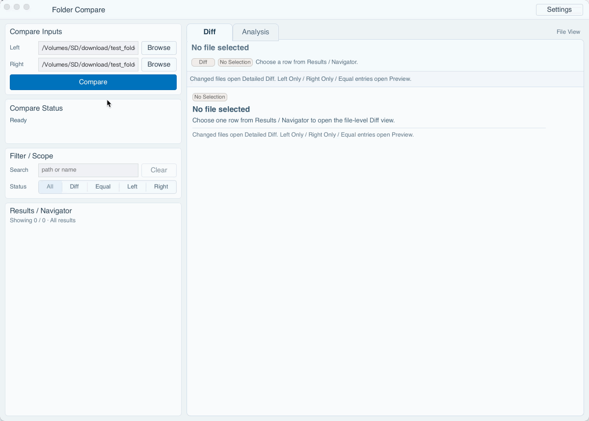

# Folder Compare (Rust Workspace)

一个面向本地目录对比的 Rust workspace，包含确定性的目录/文本 diff 引擎、可选 AI 分析层，以及基于 Slint 的桌面 UI。

当前项目状态（2026-04-05）：

- workspace `version = "0.2.18"`
- workspace `edition = "2024"`
- `rust-toolchain = 1.94.0`
- workspace `rust-version = 1.94`
- `slint = 1.15.1`
- `slint-build = 1.15.1`
- `Phase 16A` 到 `Phase 17D` 的当前稳定基线已收口完成
- `Phase 18A` 到 `Phase 18C` 的 navigator 稳定化基线已落地：
  - `Results / Navigator` 进入 `tree + flat` 双视图基线
  - 非搜索默认 mode 可由 `Settings -> Behavior -> Default view` 决定
  - 搜索非空强制 `flat results mode`
  - tree / flat 切换会把当前文件滚动回可见区域
  - flat results（搜索态与显式 flat）均支持 `Locate and Open`
- `Phase 15.x` closeout 与独立 workspace `edition = "2024"` 里程碑已完成
- `15.2E` 已在当前基线上发货
- 当前 README 只维护“最新稳定事实”，不维护 phase-by-phase roadmap



## 1. Workspace 结构

- `crates/fc-core`
  - 核心比较引擎（纯本地、确定性）
  - `compare_dirs` / `diff_text_file`
- `crates/fc-ai`
  - 可选 AI 分析层
  - `Analyzer` + `AiProvider`
  - `MockAiProvider`
  - `OpenAiCompatibleProvider`
- `crates/fc-ui-slint`
  - Slint 桌面 UI
  - compare + diff + analysis 闭环
  - 平台窗口层集成（含 macOS immersive title bar facade）

## 2. 当前稳定产品基线

- 顶层 IA 保持 `Top Bar + Sidebar + Workspace`
- Sidebar 当前稳定为四块：
  - `Compare Inputs`
  - `Compare Status`
  - `Filter / Scope`
  - `Results / Navigator`
- Workspace 当前稳定为 attached `Diff / Analysis` file-view shell：
  - `Tabs -> Header -> Content`
- `Compare Status` 保持 summary-first，并支持块内 `Show details / Hide details` 与 `Copy Summary` / `Copy Detail`
- 当前 `Results / Navigator` 代码基线已进入双视图：
  - 非搜索默认 `tree mode`
  - 搜索结果与集中扫描继续走 `flat mode`
- 层级结果视图仍然严格局限在同一 `Results / Navigator` block 内，不引入新 IA；详细边界见 `docs/architecture.md`
- Results row 信息层级当前稳定为：
  - 主信息：status pill + filename
  - 次信息：capability-first summary
  - 弱信息：parent-path disambiguation
- selection 语义当前稳定区分：
  - `no-selection`
  - `stale-selection`
  - `unavailable`
- Search / Status / Hidden-files 改变后，若当前 row 不再可见，则进入 explicit stale-selection，不自动跳到第一项
- compare 重跑只按同一路径做保守恢复；无法恢复则继续 stale

## 3. 当前 UI / 交互事实

- `Compare Inputs`
  - `Compare` 是 full-width primary action lane
  - 不再保留按钮右侧说明文案
  - disabled/running 说明由 restrained tooltip 承担
- `Filter / Scope`
  - 搜索 contract 当前为 `path / name`
  - 保留显式 `Clear` 按钮
- `Results / Navigator`
  - 顶部摘要使用集合状态文案（`Showing visible / total ...`）
  - 标题区提供 runtime `Tree / Flat` 切换
  - 非搜索默认进入 tree mode
  - 搜索高亮保持 label-level，不引入 match-span parsing
  - 搜索 contract 仍为 `path / name only`
  - 搜索非空时强制走 flat results mode
  - tree / flat 切换时，当前文件若仍有效，会自动滚动回目标视图可见区域
  - tree 中目录节点点击只负责展开/收起
  - tree 中文件 leaf 节点点击复用既有 file-view 打开链路
  - flat results 中 file leaf 支持 `Locate and Open` 回 tree
  - row tooltip 只做完整 filename + parent path completion
- `Diff`
  - 状态机：`no-selection | stale-selection -> loading -> unavailable | error -> preview-ready | detailed-ready`
  - single-side preview 继续是一等路径
  - detail 横向滚动使用显式 `ScrollView`
  - header/body 共用列几何
- `Analysis`
  - 状态机：`no-selection | stale-selection -> waiting | ready | unavailable -> loading -> error | success`
  - success 面板继续包含：
    - `Summary`
    - `Risk Level`
    - `Core Judgment`
    - `Key Points`
    - `Review Suggestions`
    - `Notes`

## 4. Settings / Tooltip / Hidden Files

- 配置入口：App Bar -> `Settings`
- 当前 Settings 只保留两个 section：
  - `Provider`
  - `Behavior`
- `Behavior` 当前包含两个持久化偏好：
  - `Hidden files`
  - 默认结果视图 `Tree / Flat`
- `Hidden files` 当前只是 UI / presentation preference：
  - 影响 `Results / Navigator` 默认可见集合
  - 影响顶部摘要文案
  - 不改 compare request
  - 不改 compare-summary source counts
  - 不改 `fc-core` contract
- tooltip 当前是 shared window-local overlay，只承担：
  - 截断文本 completion
  - disabled/running `Compare` 的 restrained hint
- tooltip 不是 explanation-heavy hover system

## 5. 平台与窗口层

- `fc-ui-slint` 当前通过 `window_chrome` 模块收口平台窗口层差异
- macOS：
  - 使用 immersive title bar strip
  - 启动前显式安装 winit backend selector
  - 通过 Slint winit hook 启用 transparent title bar / full-size content view / hidden title
  - blank-area drag 只在顶部 strip 内显式触发
- Windows / Linux：
  - 保持 legacy `SectionCard` top bar
  - 不进入新的窗口初始化路径
- 当前窗口层 baseline 不包括：
  - `no-frame`
  - raw AppKit / `objc2`
  - traffic lights reposition
  - 非 macOS 标题栏统一方案

## 6. 文本、菜单与运行时事实

- `Compare Inputs`、`Filter / Scope -> Search`、`Settings -> Provider` 普通输入框继续使用 `slint 1.15.1` 原生 editable-input context menu
- `Settings -> Provider -> API Key` 使用专用 `ApiKeyLineEdit`
  - hidden：`Paste` only
  - visible：`Select All`、`Copy`、`Paste`、`Cut`
- `Analysis success` 正文文本支持 native text-surface `Copy` / `Select All` right-click
- `Risk Level` 保持显式 `Copy` 按钮-only
- `SelectableDiffText` / `SelectableSectionText` 继续走 Slint 默认 generic family，由现有 macOS bootstrap 负责把系统字体接进来
- ordinary inputs / `ApiKeyLineEdit` 同样走 Slint 默认 generic family，由现有 macOS bootstrap 负责把系统字体接进来
- UI 主同步路径已切到 event-driven sync
- `Results / Navigator` 与 `Diff` 行模型使用 persistent `VecModel`
- `loading-mask` 与 `toast` 保持 UI-local boundary
- settings persistence 当前以 `settings.toml` 为唯一活跃基线；若只存在旧版 `provider_settings.toml`，启动时会一次性迁移

## 7. 运行方式

### 前置要求

- Rust `1.94.0`
- 推荐使用 `rustup`
- 仓库内已固定 `rust-toolchain.toml`
- macOS arm64 仍是当前主验证平台

### 启动 UI

```bash
cargo run -p fc-ui-slint
```

### 基础流程

1. 输入或 Browse 选择 Left / Right 目录
2. 点击 `Compare`
3. 在 `Results / Navigator` 中选择文件查看 `Diff`
4. 如需配置 provider 或 behavior：App Bar -> `Settings`
5. 切换到 `Analysis` 并点击 `Analyze`

## 8. Settings / OpenAI-compatible

### 持久化位置

- 配置入口：App Bar -> `Settings`
- 持久化文件名：`settings.toml`
- 配置目录优先级：
  - `FOLDER_COMPARE_CONFIG_DIR`
  - macOS：`~/Library/Application Support/folder-compare`
  - Windows：`%APPDATA%/folder-compare`
  - Linux：`$XDG_CONFIG_HOME/folder-compare` 或 `~/.config/folder-compare`

### 可用 provider

- `Mock`
- `OpenAI-compatible`

### OpenAI-compatible 必填配置

- `Endpoint`
- `API Key`
- `Model`

## 9. 常用验证命令

```bash
cargo check --workspace
cargo test --workspace
```

## 10. 文档入口

- `docs/thread-context.md`
  - 新线程交接、当前稳定事实、`Phase 18C` 之后的 handoff 入口
- `docs/architecture.md`
  - 当前稳定架构基线、`Phase 18` activation、边界与 deferred
- `docs/upgrade-plan-rust-1.94-slint-1.15.md`
  - 依赖升级与独立 edition 里程碑的归档背景

## 11. 当前开发入口

- 当前默认入口是 `Phase 17D` 后稳定基线之上的 `Phase 18C`，而不是继续重开旧 phase closeout。
- 新工作应优先复用当前：
  - Sidebar 四块 IA
  - attached `Diff / Analysis` shell
  - explicit stale-selection / unavailable 语义
  - tooltip / Settings / Hidden-files 边界
  - macOS immersive title bar / non-mac legacy top bar contract
- `Phase 18C` 当前额外约束：
  - tree 与 flat 双视图并存
  - 搜索非空时强制 flat mode
  - tree logic 放在 Rust presenter/state，Slint 只渲染 visible rows
  - tree / flat 与 locate 的可视区域连续性已是当前基线，不再视为 deferred
- README 下方保留长期 roadmap 参考；如需判断当前下一阶段可做什么，直接参考 `docs/architecture.md`。

## 12. 长期路线（参考）

- 本节用于保留产品长期方向，便于快速理解项目后续可能演进到哪里。
- 这是方向性 roadmap，主要保留历史演进脉络参考。
- 它不覆盖 `docs/architecture.md` 中的当前稳定事实，也不替代当前线程的实际执行入口。
- phase 编号按当前真实推进事实校正；已确认的 `Phase 17` 实际落点是 `Settings` 升级，因此原先其后的长期路线整体顺延。

- `Phase 16`
  - 结果视图增强（状态筛选 / 排序 / 更强过滤）
- `Phase 17`
  - `Settings` 升级（设置入口统一、Provider / Behavior 分区、首轮行为偏好）
- `Phase 18`
  - 层级结果视图 / tree component / flat results 双视图
- `Phase 19`
  - Compare View / File View 双模式工作区
- `Phase 20`
  - AI 分析增强（多任务 / hunk 关联 / 缓存）
- `Phase 21`
  - Diff / Analysis 高级交互
- `Phase 22`
  - 后台任务与性能体系
- `Phase 23`
  - 产品化收尾
