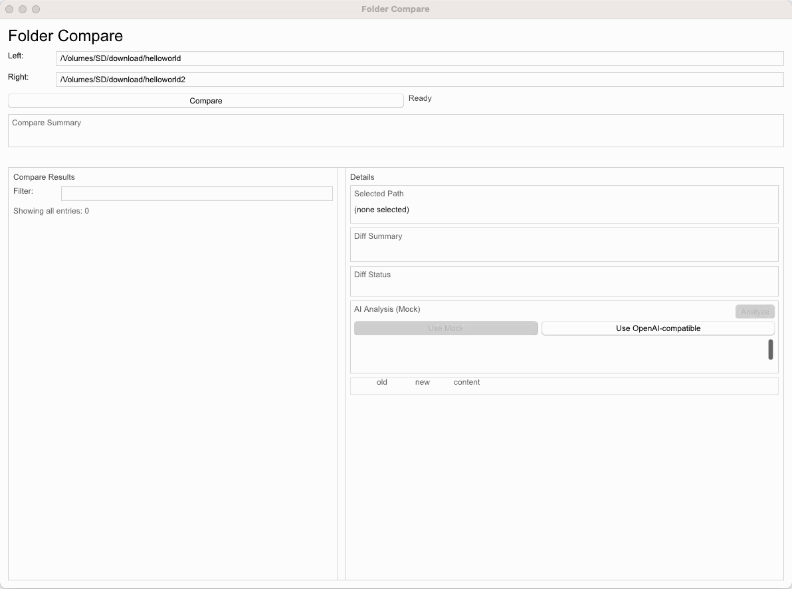

# Folder Compare (Rust Workspace)

一个面向本地目录对比的 Rust workspace 项目，当前已完成：

- 目录对比（summary）
- 文本详细 diff（hunk/line）
- AI 分析面板（支持 Mock 与 OpenAI-compatible 远程 provider）
  

## 1. Workspace 结构

- `crates/fc-core`
  - 核心比较引擎（纯本地、确定性）
  - `compare_dirs` / `diff_text_file`
- `crates/fc-ai`
  - AI 分析能力层
  - `Analyzer` + `AiProvider` trait
  - `MockAiProvider`（稳定演示）
  - `OpenAiCompatibleProvider`（真实远程调用）
- `crates/fc-ui-slint`
  - Slint 桌面 UI
  - compare + detailed diff + analysis 闭环

## 2. 已完成阶段（Phase 1-12）

- Phase 1-7：workspace、core 主能力、文本 diff、大目录/大文件保护
- Phase 8：`fc-ai` 最小可用化（Analyzer + Mock）
- Phase 9-10：UI compare MVP + detailed diff 面板
- Phase 10.5-10.8：UI 可用性/布局/同步修复
- Phase 11：UI 集成 `fc-ai` mock provider
- Phase 12：OpenAI-compatible 真实 provider + UI provider 配置切换

## 3. 当前能力总览

- Compare 主闭环
  - 路径输入
  - summary / warnings / truncated / error
  - 结果筛选与选择
- Detailed Diff 面板
  - 统一视图（hunk + line）
  - diff loading / warning / truncated / error 独立展示
- AI Analysis 面板
  - provider mode 切换（Mock / OpenAI-compatible）
  - OpenAI-compatible 最小配置（endpoint / api key / model）
  - analysis loading / error / result 独立展示
  - 远程提示：会发送 diff excerpt 到配置 endpoint

## 4. 运行方式

### 前置要求

- Rust 1.75+
- macOS 优先（Windows / Linux 也考虑支持）

### 启动 UI

```bash
cargo run -p fc-ui-slint
```

### 基础流程

1. 输入 Left/Right 目录
2. 点击 Compare
3. 选择结果行查看 Detailed Diff
4. 在 Analysis 区选择 provider 并点击 Analyze

## 5. OpenAI-compatible 说明

### 必填配置

- `Endpoint`：OpenAI-compatible 根路径（如 `https://api.openai.com/v1` 或本地兼容网关）
- `API Key`
- `Model`

### 调用路径

- UI -> `AnalyzeDiffRequest`
- `Analyzer`（validation + truncation + prompt）
- `OpenAiCompatibleProvider`（`chat/completions`）
- 响应映射为结构化 `AnalyzeDiffResponse`

### 错误分类（已结构化）

- 配置缺失（endpoint/api key/model）
- endpoint 无效
- 超时
- 网络失败
- HTTP 非成功状态
- 响应解析失败（invalid json / missing content / invalid contract）

## 6. 测试与验证

```bash
cargo check --workspace
cargo test --workspace
```

测试原则：

- 不依赖真实外网
- 远程 provider 测试使用本地 mock server / fake response
- UI 测试重点覆盖 bridge/presenter/state 编排逻辑

## 7. 设计边界

- `fc-core` 不依赖 UI/AI
- `fc-ai` 不侵入 core 逻辑
- UI 负责编排与展示，不承载核心业务规则
- compare / diff / analysis 三层状态严格分离

## 8. 当前未实现（刻意留白）

- 高级设置面板（持久化 profile、密钥安全存储）
- 响应缓存与 token/cost tracking
- 多 provider 插件化扩展
- 目录树 / 双栏目录比较高级视图

## 9. 后续主线（参考路线）

- Phase 13：UI 信息架构重构（Sidebar + Workspace）
- Phase 14：Provider Settings 与配置持久化
- Phase 15：File View 深化（Diff / Analysis Workspace）
- Phase 16：结果视图增强（状态筛选 / 排序 / 更强过滤）
- Phase 17：目录树 / 层级视图
- Phase 18：Compare View / File View 双模式工作区
- Phase 19：AI 分析增强（多任务 / hunk 关联 / 缓存）
- Phase 20：Diff / Analysis 高级交互
- Phase 21：后台任务与性能体系
- Phase 22：产品化收尾
